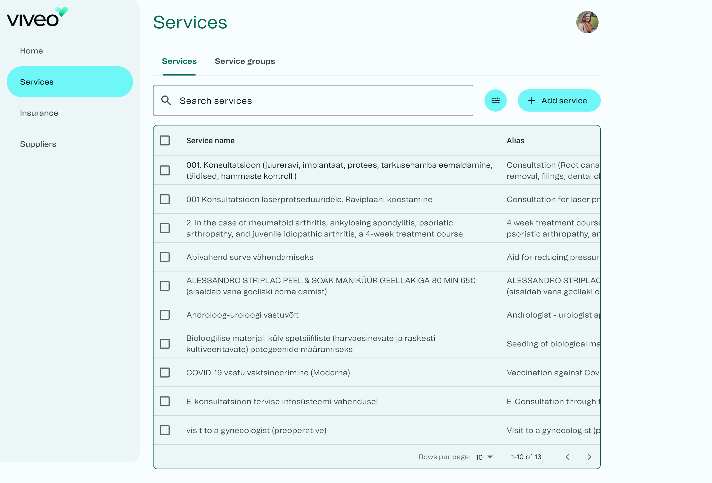

## Project overview
Since the change of business direction for Viveo health, there was a creation of a wide range of new applications to support the many different areas that help support the business. In order to manage these, it was requested to create an admin app that allows the ops team to easily control everything.

I took up the role as lead product designer and with the knowledge of designing the latest product range for Viveo, I was already well equipped to dive straight into the creating the new admin application.

The main goal for this project was to create a tool that assisted our ops team achieve their daily needs without slowing them down.

## Exploration
The exploration stage of the project was rather easy as it involved discussions with members of the ops team to fully understand their pain points and needs from the application. It turned out that it was going to be quite extensive, considering Viveo health will integrate with multiple service providers, insurance companies and users to deliver a high quality healthcare experience.

From the exploration stage it was agreed that there were three main areas to focus on. These were services, insurance and suppliers which was the easiest way for each of the ops team members to understand the difference between each section.