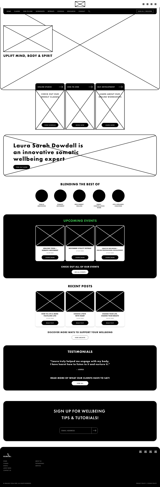
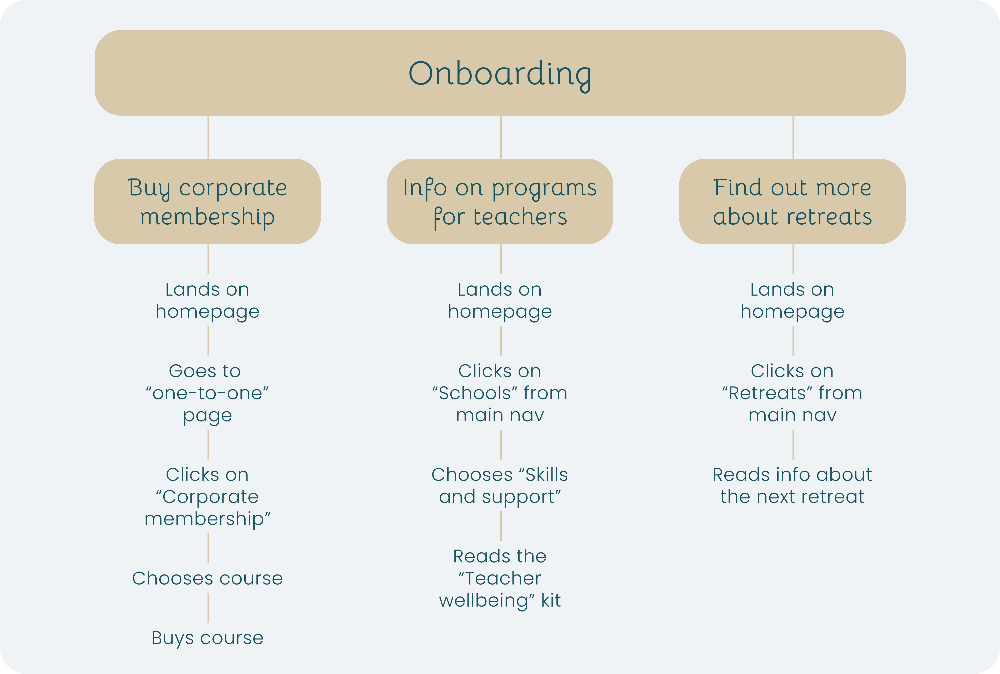

## Project Overview
I was tasked with the creation of a new website design for Healing Yoga as they looked to expand their business to also sell online courses along with their already existing in-person classes and treatments. The aim of the site was to be informational about the services offered by healing yoga and for allowing clients to buy online courses and book in-person classes through the site.

My role for this project was to define the goals of UX research,create wireframes, design hi-fidelity prototypes and develop the eLearning website.

## UX Research
For this project, we concentrated on getting users to complete a survey to understand what they would like from the website. These surveys went out to the current client list of Healing Yoga and had great results in terms of feedback that went on to shape the new design of the site.

Below you will see the main user flows that came from the research and that "happy path" to reach these user goals.

## Final Outcome
The project finished with the client being satisified with the final product, a wordpress eLearning website and was already starting to take bookings for her new subscription module.