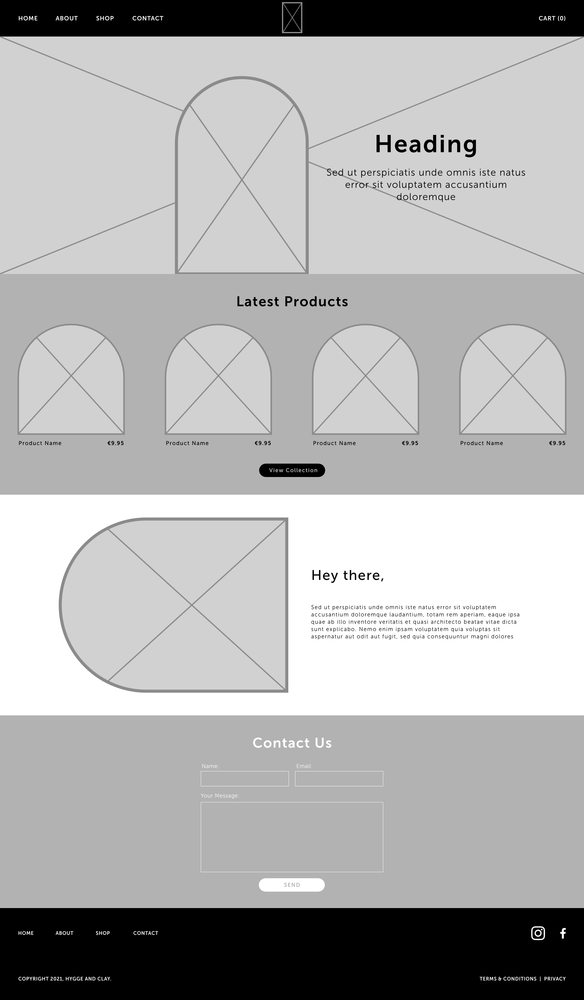
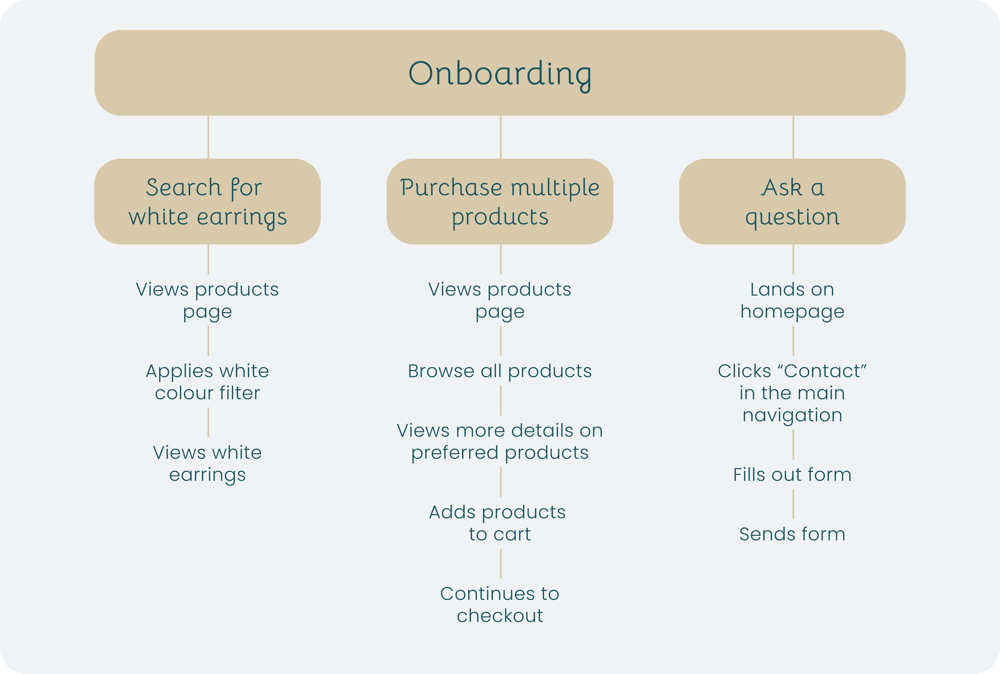

## Project Overview
I was trusted to curate a personal journey and experience for potential consumers of the Hygge and Clay brand. The main aim for the website is to sell products which can be achieved by showcasing each project on the site and including a shopping function.

My role for this project consisted of creating a user friendly shopping experience, create detailed wireframes, make conscious decisions on how the user would navigate through the website based on the company goals and to ensure a consistent and elegant execution of the work that allowed the brand and it's products to stand out.

## UX Research
Due to client budgets, we were unable to conduct a full UX strategy on the project. Instead, I used my alternative solution to create a strong user centric experience by fully understanding the business goals and putting myself in the shoes of the user. Although this is not the best practice for any UX project, when the budget is tight, it is a good alternative.

As part of getting to know the Hygge and Clay brand, I spent time looking into other small business sites, craft business and understanding the experience they gave to their users. From my findings, it was as expected that most businesses in this area focus on getting sales so the shop is the main priority on the site.

Below you will see the "happy path" for the users based on some key scenarios.

## Final Outcome
On completion of this project, the client had a fully functioning Shopify eCommerce store and was ready for the full launch of their new business.