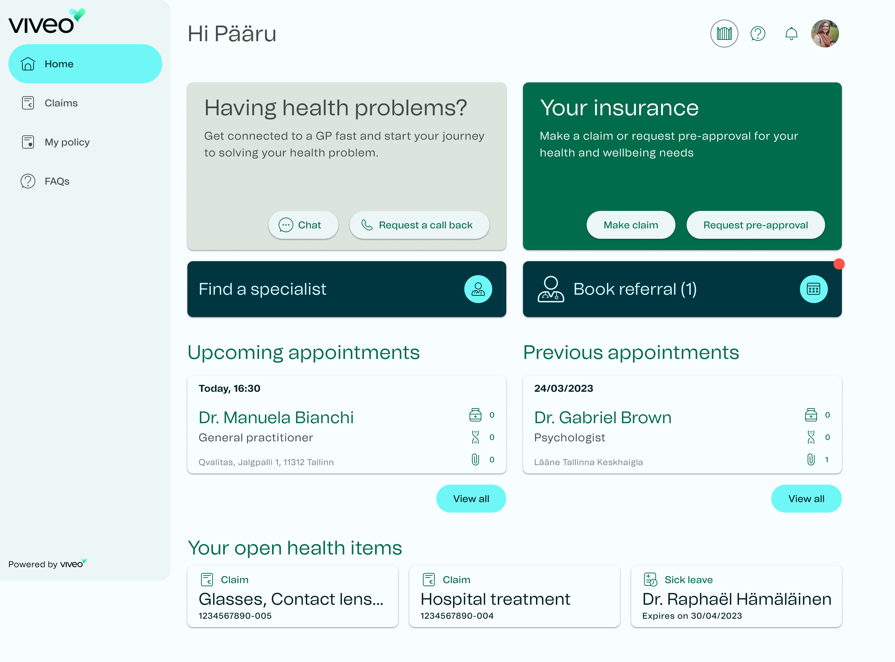

## Project overview
As our current products were not achieving their goals, and as a business it was needed to take a new direction based on the learnings of the previous years failures, Viveo health needed to take a step back and recreate the patient application.

I took up the role as lead product designer and having worked with Viveo since September ‘21, I quickly re-evaluated the current patient application at the time and took steps towards bringing consistency and simplicity.

The main goal for the project was to create an application that allows users to book appointments with medical experts, however, this goal grew as the timeline moved.

## Exploration
At this stage, we weren’t in a position to perform user testing so understanding the flows and what might work best meant exploring from within the business and coming up with flows that made sense and were easy to use with the aim of doing the user testing at a later stage.

As one of the aims was to create the product in a way that would be quick and cost efficient to implement, it was time to explore the best options for how to design the application. Having checked out different design systems and discussions with the engineering team, I decided it was best to use Google’s Material Design Kit.

## Latest updates
Having successfully designed Version 1 of the patient app with the goal of product exploration and understanding our flows, along with the expanding goals for the product during this phase. 

I took it upon myself to start creating Version 2 of the product, with the aim of making it more flexible to the growing business needs and engaging for users by using more visual references to help navigate the application.

I have also created a full user testing strategy and plan with the aim to start testing the product with users in Q1 2024.